# Master Map

**Every note in this vault, and the shortest route to the one you want.** 🚀 `mcpaudit` is
shipped: `@aethereumdev/mcp-audit@0.1.0` went live on npm on **2026-08-15**.

```mermaid
flowchart TD
    MM["(Map) Master Map"] --> PS["(Report) Project Summary"]
    MM --> FI["(System) Flint Init"]
    MM --> HQ["(Guide) BRUNO HQ"]
    MM --> S00["00 Overview"]
    MM --> S10["10 Architecture"]
    MM --> S20["20 Codebase Map"]
    MM --> S30["30 Setup & Run"]
    MM --> S40["40 Data & Integrations"]
    MM --> S50["50 Decisions & ADRs"]
    MM --> S60["60 Roadmap, Tasks & Ideas"]
    MM --> S70["70 Ops, Deploy & Env"]
    MM --> S80["80 Testing & Quality"]
    MM --> S90["90 Reference"]
    MM --> AUD["(Report) Folder Audit"]
    MM --> INV["(Index) Complete File Inventory"]
    MM --> GAP["(Report) Gaps & Questions"]
    MM --> LOG["(Report) Build Log"]
    S00 --> W["What mcpaudit Is"]
    S00 --> H["Honest State"]
    S00 --> G["Git History"]
    S10 --> SA["System Architecture"]
    S10 --> ED["Era Detection"]
    S10 --> RM["The Rule Model"]
    S20 --> ST["Source Tree"]
    S20 --> FX["Fixture Servers"]
    S30 --> IR["Install and Run"]
    S30 --> CS["Command Surface"]
    S40 --> DM["Data Models"]
    S40 --> EX["External Services"]
    S50 --> LD["Locked Decisions"]
    S60 --> RD["Roadmap"]
    S70 --> RC["Release and CI"]
    S70 --> EV["Environment Variables"]
    S80 --> TS["Test Suite"]
    S90 --> RCAT["Rule Catalogue"]
    S90 --> ARS["Audited Reference Servers"]
```

## Start here if you want to

| I want to | Open |
|---|---|
| Understand the project in one page | [[(Report) Project Summary]] |
| Know what the tool actually does | [[(Note) What mcpaudit Is]] |
| Know what is broken or unfinished | [[(Note) Honest State]] · [[(Report) Gaps & Questions]] |
| Run it right now | [[(Note) Install and Run]] |
| Know every flag | [[(Note) Command Surface]] |
| Understand how it decides what to check | [[(Note) Era Detection and the Protocol Client]] |
| Read the design of a check | [[(Note) The Rule Model]] · [[(Note) Rule Catalogue]] |
| Find a file | [[(Note) Source Tree]] · [[(Index) Complete File Inventory]] |
| See what it found in the wild | [[(Note) Audited Reference Servers]] |
| Add a rule | [[(Note) The Rule Model]] · [[(Note) Test Suite]] |
| Ship a release | [[(Note) Release and CI]] |
| Know why a decision was made | [[(Note) Locked Decisions]] |
| Know what is next | [[(Note) Roadmap]] |
| Audit this vault itself | [[(Report) Folder Audit]] · [[(Report) Build Log]] |

## Outline

**Top level**
[[(Report) Project Summary]] · [[(System) Flint Init]] · [[(Guide) BRUNO HQ]] ·
[[(Report) Folder Audit]] · [[(Index) Complete File Inventory]] ·
[[(Report) Gaps & Questions]] · [[(Report) Build Log]]

**Sections**
[[(Index) 00 Overview]] · [[(Index) 10 Architecture]] · [[(Index) 20 Codebase Map]] ·
[[(Index) 30 Setup & Run]] · [[(Index) 40 Data & Integrations]] ·
[[(Index) 50 Decisions & ADRs]] · [[(Index) 60 Roadmap, Tasks & Ideas]] ·
[[(Index) 70 Ops, Deploy & Env]] · [[(Index) 80 Testing & Quality]] ·
[[(Index) 90 Reference]]

**Plumbing**
[[(Index) Sources]] · [[(Note) Media]] · [[(Note) Exports]] ·
[[codebase-map-refresh]] · [[changelog-from-git]] · [[onboarding-guide]] · [[vault-audit]]

## Up

[[(Map) BRUNO HQ]] · [[(Guide) BRUNO HQ]]
