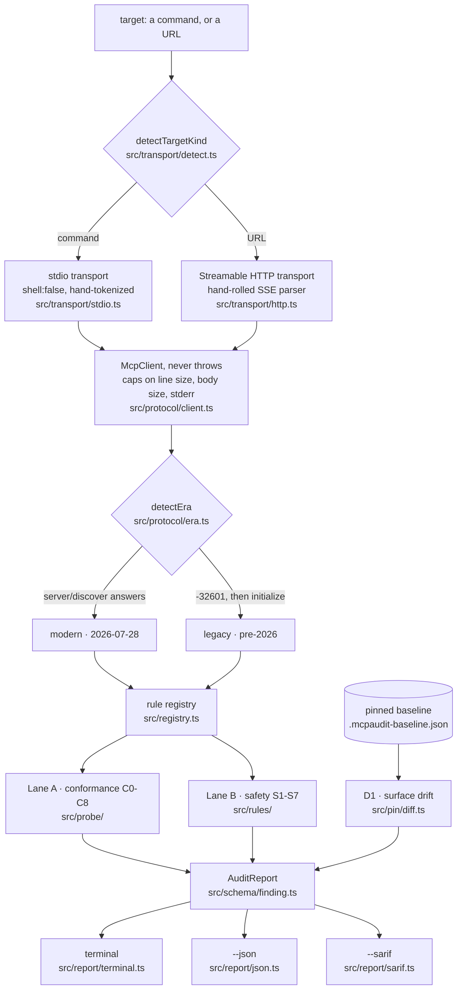

# System Architecture

**One pipeline, four layers, no cycles.** `src/engine.ts` (6.5 KB) is the only file that knows
the whole sequence. Everything else knows only its own layer.

## Layer 1, transport

`detectTargetKind` looks at the target string. A URL becomes Streamable HTTP; anything else is
a command to spawn.

**stdio is spawned with `shell: false` and a hand-written tokenizer.** That is a security
decision, not a style one: a crafted target string must not be able to smuggle shell
metacharacters into process spawning. `stdio.ts` is **9,458 bytes**, the second largest source
file, mostly because of the caps: line size, total body size and stderr are all bounded, so a
server that emits an unbounded stream cannot exhaust memory.

**HTTP is hand-rolled**, including the SSE parser, because using `undici` would break the
zero-dependency claim. Node's built-in `fetch` does the transport.

## Layer 2, protocol

`McpClient` **never throws**. Every request returns an outcome from a closed union: `result`,
`error`, `timeout`, `transport-error`, `invalid-json`, `invalid-envelope`. A hostile server is
data, not an exception.

That single design choice is why the hostile fixture tests passed on the first run. A server
that emits garbage, hangs, dies mid-conversation or sends a frame with no trailing newline
produces a **finding** rather than a stack trace.

`src/protocol/types.ts` holds `LATEST_PROTOCOL_VERSION`, the constant the weekly spec-drift
workflow greps out of the file to compare against the published revision listing.

## Layer 3, rules

The registry in `src/registry.ts` is **1,397 bytes**, which is the whole point: adding a rule
is adding a file and one registry line. Every rule declares which eras it applies to, and the
engine filters by the resolved era **before** running anything. See
[[(Note) The Rule Model]].

Lane A lives in `src/probe/` (6 files, `c0` through `c8`, grouped so `c4-c5-c6.ts` and
`c7-c8.ts` share their probe traffic). Lane B lives in `src/rules/` (5 rule files plus
`text.ts`, the shared matcher helpers, and `types.ts`).

`D1_SURFACE_DRIFT` sits **outside** the registry, in `src/pin/`, because it needs a
caller-supplied baseline rather than a live probe. That is why `src/rules/` holds seven files
while the documentation counts eight safety checks.

## Layer 4, report

`AuditReport` is the contract, defined in `src/schema/finding.ts` and hand-validated rather
than via zod. Three renderers consume it:

- **`terminal.ts` plus `theme.ts`.** ANSI-16 palette only, plain and nerd-font icon duality, a
  `" | "` separator, plain and powerline modes. The palette shape is inherited from ccline's
  TOML themes, so existing theme files drop in. `NO_COLOR`, `--no-color` and a non-TTY stdout
  all collapse it to plain monospace with box drawing.
- **`json.ts`**, **632 bytes**, because the report object is already the JSON contract.
- **`sarif.ts`**, SARIF 2.1.0 for GitHub code scanning.

`--json` and `--sarif` are **never styled**. Every finding is passed through
`sanitizeSnippet` before display, because a server flagged for ANSI injection would otherwise
be able to inject ANSI into the report that flags it.

## Related

[[(Note) Era Detection and the Protocol Client]] · [[(Note) The Rule Model]] ·
[[(Note) Source Tree]] · [[(Note) Data Models]] · [[(Index) 10 Architecture]]
