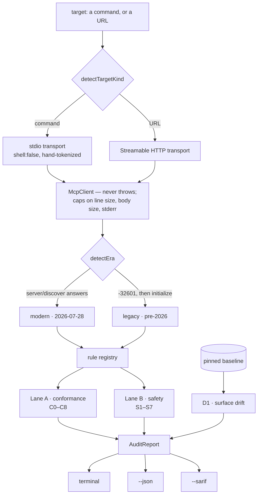

# mcpaudit

[](https://www.npmjs.com/package/@aethereumdev/mcp-audit)
[](https://github.com/br9704/mcpaudit/actions/workflows/ci.yml)
[](#supply-chain)
[](#supply-chain)
[](./LICENSE)

**A conformance + safety linter for MCP servers.** Point it at any Model Context Protocol
server — stdio or Streamable HTTP — and get a report.


```bash
npx @aethereumdev/mcp-audit "npx -y @modelcontextprotocol/server-filesystem /tmp"
```

Zero runtime dependencies. No API key. No telemetry. The only network traffic is to the
server you asked it to audit.

---

## What it found

Real audits of four official reference servers, run with this tool at v0.1.0. Raw
`--json` output for every row is committed under [`audits/`](./audits) — nothing here is
summarised by hand. The **Reports itself as** column is the server's own `serverInfo`,
which is what the audit records; it does not always match the npm package name.

| Server (npm) | Reports itself as | Protocol | Findings |
|---|---|---|---|
| `@modelcontextprotocol/server-everything` | `mcp-servers/everything` 2.0.0 | 2025-11-25 | 1 warn, 1 info |
| `@modelcontextprotocol/server-filesystem` | `secure-filesystem-server` 0.2.0 | 2025-11-25 | 1 warn, 1 info |
| `@modelcontextprotocol/server-memory` | `memory-server` 0.6.3 | 2025-11-25 | 1 warn, 1 info |
| `@modelcontextprotocol/server-sequential-thinking` | `sequential-thinking-server` 0.2.0 | 2025-11-25 | 1 warn, 1 low, 1 info |

The headline is the **Protocol** column. The current specification revision is
`2026-07-28`, which removed the `initialize` handshake and made `server/discover`
mandatory. Every server above — and every SDK we could find — still speaks an
`initialize`-era revision. That is not a defect in these servers; it is where the
ecosystem is. It is also why every check in this tool is *era-aware*: checks written for
the stateless protocol are **skipped with a stated reason** against older servers rather
than failed. Without that, this table would be a wall of false failures.

The recurring `warn` is finding `C8_ANSWERS_BEFORE_INITIALIZE`, from rule
[`C8_LEGACY_PREINIT`](./RULES.md): all four answer `tools/list` on a fresh connection with
no handshake sent. The specification calls this out directly as a version-negotiation
hazard, and it is why it recommends probing with `server/discover` first even for clients
that only speak modern revisions.

**No exploitable vulnerability was found in any audited server, and nothing here was
disclosed privately first because there was nothing to disclose.** These are hygiene and
spec-currency observations about servers that are, by design, demonstration and reference
implementations.

---

## What this is, honestly

> **A first-pass linter that catches common issues — not a security audit.**

That framing is load-bearing. This tool reads what a server *says about itself* — tool
names, descriptions, schemas, annotations, protocol behaviour — and applies documented
heuristics. It does not execute tools in a sandbox, analyse server source, or prove
anything. A clean report means "nothing common was found", not "this server is safe".

Every check documents **how it misfires**, in [RULES.md](./RULES.md), which is *generated
from the rule metadata in code* so the docs cannot drift. `falsePositiveModes` is a
required field on every rule, and CI fails if the committed RULES.md is stale.

This discipline is not decorative. Auditing the official filesystem server surfaced four
findings that turned out to be false positives — the word "clearly" in a description was
matching the destructive verb `clear`. That bug was found by hand-reviewing every finding
before publishing this table, and there are now regression tests for those exact strings.
If a check fires on your legitimate server, that is a bug in the check; please report it.

---

## Two lanes

**Lane A — conformance.** Does it implement the specification correctly? Built against
`2026-07-28` (stateless) first, with a back-compat lane for `initialize`-era servers.
Nine checks, `C0`–`C8`.

**Lane B — safety.** Is it dangerous? Tool poisoning, annotation contradictions,
credential exposure, `$ref` SSRF, cross-server shadowing, terminal-escape injection,
unsafe icon URIs. Seven checks, `S1`–`S7`. These are **heuristics** — they surface signals
a human should look at; they do not prove anything.

**Plus drift.** `D1_SURFACE_DRIFT` diffs a server against a baseline you pinned earlier.
It lives outside the rule registry because it needs a caller-supplied baseline, which is
why `src/rules/` holds seven files while the documentation lists eight safety checks.

17 checks in total. All of them are in [RULES.md](./RULES.md), with their false-positive
modes.

## Architecture



Two decisions shape everything above.

**Era is resolved before any check runs.** Every rule declares which eras it applies to,
and an inapplicable check is *skipped with a reason*, never failed. This was not the
original design; it became mandatory once research showed that no shipping server
implements `2026-07-28`. Firing modern checks at legacy servers would produce a wall of
false positives and destroy the tool's credibility on contact.

**The transport never throws.** A hostile server is data, not an exception — every
request returns an outcome (`result`, `error`, `timeout`, `transport-error`,
`invalid-json`, `invalid-envelope`), so a server that emits garbage, hangs, or dies
mid-conversation produces a finding rather than a stack trace.

## How it was built

The full record is in [masterplan.md](./masterplan.md) — sprint by sprint, with as-shipped
deltas, deferrals and their reasons. Four repairs are worth pulling out, because each one
is a bug a green test suite was actively hiding.

**The CLI worked in tests and produced no output when packed.** The
`import.meta.url === file://${process.argv[1]}` entry-point guard silently fails under
`npx`, because npm installs `bin` as a symlink. Every unit test passed throughout. Only an
acceptance test that ran the *packed binary* caught it, so packing-and-running is now a CI
step rather than a pre-release ritual.

**A determinism check never fired because the fixture was a palindrome.** The
deliberately-broken fixture reversed its tool order to trip `C2_NONDETERMINISTIC_ORDER`,
but its tool names were symmetrical, so reversal was a no-op. A fourth tool broke the
symmetry. Similarly, `S6_CONTROL_IN_OUTPUT` scanned the raw wire bytes, where an ESC byte
always arrives already JSON-escaped, so it could never match. It now scans decoded text.

**Two false positives on the benign fixture were both modes I had documented but not
implemented.** `S1_HIDDEN_CHARACTERS` fired on the zero-width joiners inside an emoji
sequence; `S2_DESTRUCTIVE_CLAIMS_READONLY` fired on `remove_background`. The fix was a
two-tier verb model: strong verbs (`delete`, `drop`, `purge`, `wipe`) count alone, weak
verbs (`remove`, `reset`, `clear`) count only when paired with a stateful object and only
in the tool *name* — prose is too noisy to carry that signal.

**The rug-pull detector hashed uncanonicalised JSON**, so a server that merely reordered
its keys would have looked like a deliberate downgrade on every re-audit. Keys are sorted
before hashing now, and that is tested explicitly.

Two more, briefly: the report sanitises every finding before display, because otherwise a
server flagged for ANSI injection could inject ANSI into the report flagging it. And the
first version of the weekly spec-drift job was circular — it read the protocol version out
of the versioned file, which always matches itself; it now compares against the published
revision directory listing.

## Verification

| | |
|---|---|
| Tests | **114**, across 13 files |
| CI | Node 20, 22, 24 — lint, typecheck, test, RULES.md staleness, packed-CLI smoke test |
| Fixtures | 8 stdio servers: benign, hostile, legacy, malicious, modern-bad, modern-good, reserved-code, shadow |
| Network required | none — every fixture runs locally |

The hostile fixture is the interesting one. It serves a 2000-tool list, a 400-deep schema,
a 500-notification flood, garbage on stdout, truncated JSON, wrong-shaped envelopes, a
frame with no trailing newline, a server that says nothing at all, and a server that exits
mid-conversation. Those tests passed on the first run, which is the payoff for the size
caps and never-throw transport rather than a coincidence.

The image at the top of this page is generated, not drawn:
[`scripts/make-demo-svg.mjs`](./scripts/make-demo-svg.mjs) runs the built CLI against a
real server, parses the ANSI it emits, and writes the SVG. Regenerate it with
`npm run build && node scripts/make-demo-svg.mjs`. The elapsed time in the summary line is
a real measurement, so it moves between runs.

Reproduce the two ends of the range yourself, with no network:

```bash
npm run build
node dist/cli.js "node fixtures/malicious/server.mjs"   # 12 error, 10 warn — exit 1
node dist/cli.js "node fixtures/benign/server.mjs"      # clean — exit 0
```

## Usage

```bash
# stdio (a command)
npx @aethereumdev/mcp-audit "npx -y @modelcontextprotocol/server-memory"

# Streamable HTTP (a URL)
npx @aethereumdev/mcp-audit https://example.com/mcp

# CI: SARIF for GitHub code scanning
npx @aethereumdev/mcp-audit https://example.com/mcp --sarif > mcp.sarif

# Cross-server shadowing needs more than one target
npx @aethereumdev/mcp-audit "npx -y server-a" "npx -y server-b"
```

Anything after `--` is passed through verbatim to a stdio server command.

### Rug-pull detection

A server can pass review and then quietly rewrite a tool description — which changes the
instructions your model follows, with no version bump and no code change on your side.
Pin the surface, then diff it:

```bash
npx @aethereumdev/mcp-audit "npx -y my-server" --pin          # writes .mcpaudit-baseline.json
npx @aethereumdev/mcp-audit "npx -y my-server" --baseline .mcpaudit-baseline.json
```

Drift reports which field changed, with the old and new values inline. Description and
schema changes are errors, because they alter what the model is told. Annotation changes
that *weaken* a safety claim (`destructiveHint` flipping to `false`) are called out
separately, because that is the shape of a deliberate downgrade rather than an ordinary
release edit. Drift means "changed since you approved it" — not "malicious".

### Options

| Flag | Meaning |
|---|---|
| `--json` | machine-readable report on stdout |
| `--sarif` | SARIF 2.1.0, for GitHub code scanning |
| `--fail-on <level>` | `info` \| `low` \| `warn` \| `error` (default `warn`) |
| `--pin[=<path>]` | write a baseline snapshot (default `.mcpaudit-baseline.json`) |
| `--baseline <path>` | diff against a baseline; drift is a finding |
| `--timeout <ms>` | per-request timeout (default `10000`) |
| `--color` / `--no-color` | force or disable ANSI colour; `NO_COLOR` is respected |
| `--icons <mode>` | `auto` \| `plain` \| `nerd` \| `none` (default `auto`) |
| `-h, --help` · `-v, --version` | |

`--pin` takes its optional path with `=` only (`--pin=path`); a bare `--pin path` reads
`path` as another target. `--json` and `--sarif` are never styled.

**Exit codes:** `0` clean · `1` findings at or above `--fail-on` · `2` tool or connection
error, including a server we could not talk to at all. Designed for CI.

## Supply chain

A security tool's own dependency tree is part of its argument.

| Runtime dependencies | **0** |
|---|---|
| Install lifecycle scripts | **none** — nothing runs on `npm install` |
| Network calls | only to the server you name |
| Node | ≥ 20 |

Both the zero-dependency claim and the absence of install scripts are
[enforced by a test](./test/supply-chain.test.ts), not just asserted here. Development
uses TypeScript, vitest and eslint; none of it ships. What that costs is spelled out under
Limitations.

## Limitations

A credibility section, not a weakness section. Everything here is a deliberate boundary.

- **Schema validation is structural, not semantic.** `inputSchema` is checked for being
  parseable, an object, `type: "object"` at the root, and bounded in depth and `$ref`
  count — not validated against JSON Schema 2020-12, which would need a validator
  dependency. A schema can pass this check and still be rejected by a strict validator.
- **Only tools are inspected.** Resource descriptions and prompt templates carry the same
  injection surface and are not covered yet.
- **The modern lane is exercised against hand-written fixtures**, because no shipping
  server implements `2026-07-28`. `C7_HTTP_HEADERS` in particular has never met a real
  modern HTTP server; none exists.
- **No token-passthrough or OAuth-metadata SSRF check.** Deferred for the same reason:
  there is no live `2026-07-28` auth server to test against.
- **`S5_CROSS_SERVER_SHADOWING` needs two or more targets** in a single run, and is
  skipped otherwise.
- **No sandboxed execution, no source analysis, no spec-completeness claim.** This covers
  common cases. It says so on purpose.
- **Heuristics misfire.** Every rule ships at least two documented false-positive modes.
  A false positive on your legitimate server is a bug in the check — please file it.

## Status

v0.1.0. All eleven engineering sprints are closed: both transports, 17 checks, era
detection, terminal/JSON/SARIF output, pin-and-drift, 114 tests, CI on three Node
versions, and a release pipeline on npm trusted publishing (OIDC) with automatic
provenance. Release is tag-driven; no npm token exists in the repo or in CI.

One caveat worth stating rather than letting you discover it: **0.1.0 was published by
hand, so it carries no provenance attestation** — `npm view @aethereumdev/mcp-audit
dist.attestations` is empty. Only a CI publish can produce one, and none can be added
retroactively.

The release workflow carries no npm token by design and authenticates solely through
trusted publishing, which is configured once on the registry side. Until that is done,
releases are published manually and the workflow is inert rather than broken: it refuses a
tag that disagrees with the manifest, skips a version that is already on the registry, and
explains itself if authentication is not yet set up.

Next, in rough order of usefulness: resource and prompt coverage, an env-dump rule for
tools that return the whole environment, `S8` token passthrough once there is anything to
test it against, and `--theme` loading for the TOML palettes the terminal report already
understands. See [CONTRIBUTING.md](./CONTRIBUTING.md) for these as good first issues, and
the owner-gate block at the end of [masterplan.md](./masterplan.md) for what is left.

## Contributing

New rules and false-positive reports are equally welcome. A rule needs a stable id, a
`why` that can be checked against the specification, at least two honest false-positive
modes, a remediation, and both a fixture that triggers it and one that must not. See
[RULES.md](./RULES.md) and the servers under [`fixtures/`](./fixtures).

Security issues in **this tool** go to jaamaabruno@gmail.com. For issues found *by* this
tool in someone else's server, see [SECURITY.md](./SECURITY.md).

## License · Author

MIT © [Bruno Jaamaa](https://brunojaamaa.dev) · [github.com/br9704](https://github.com/br9704)
